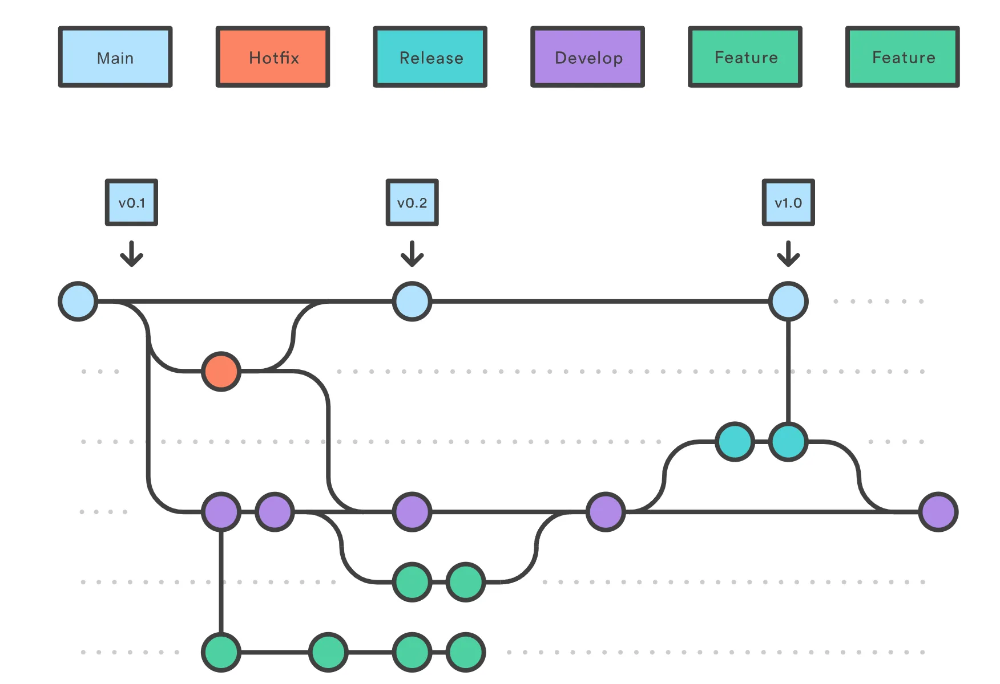
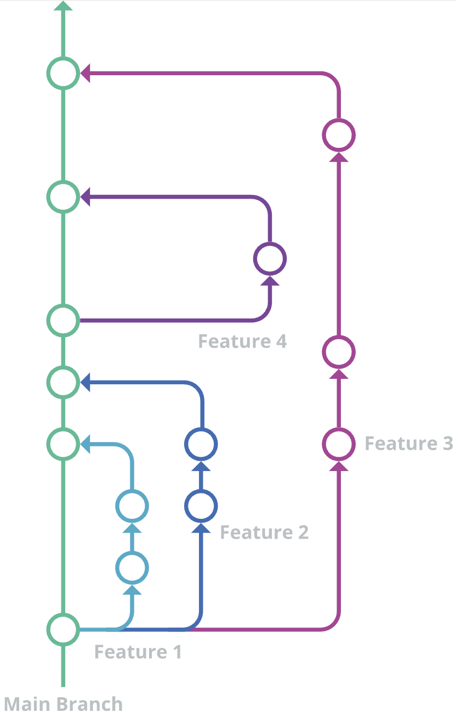
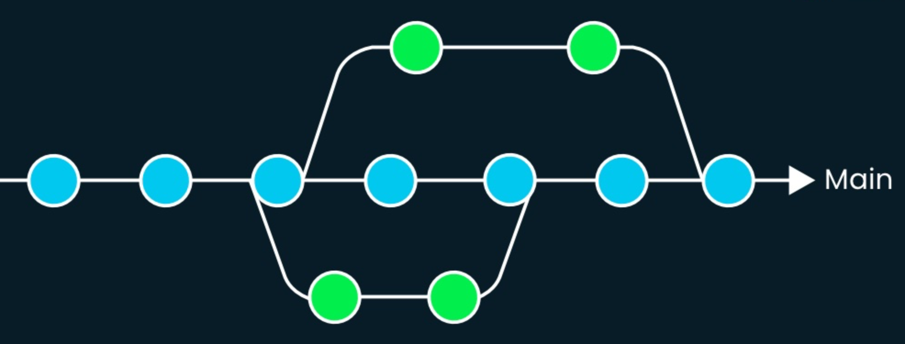

## **Branching strategy(40)**

### Git Flow

### GitHub Flow

GitHub flow is a lightweight, branch-based workflow.

Mainline: Main(Master) branch - 모든 작업의 시작점.

Devline: Feature branch

**특징**

- Mainline과 배포 brach 동일
    - Main branch 역할: Mainline + Stable branch

**Following GitHub flow**

**Create a branch**

Repository에서 새로운 브랜치 생성.

- 브랜치를 만들면 기본 브랜치에 영향을 주지 않고 작업할 수 있는 공간 생성, 또한 공동 작업자에게 작업 내용을 검토할 수 있는 기회를 제공.

**Make changes**

새로운 기능을 추가하거나 버그를 수정하기 위해 코드 변경

**Create a pull request**

풀 리퀘스트를 만들어 공동 작업자에게 변경 사항에 대한 피드백을 요청

**Address review comments**

리뷰어는 풀 리퀘스트에 댓글(의견, 제안) 추가

**Merge your pull request**

pull request가 승인되면 pull request를 병합, conflict가 발생하면 해결 후 병합

**Delete your branch**

pull request 병합 후 브랜치 삭제

브랜치 삭제해도 pull request와 commit history는 삭제 되지 않음

### Trunk-Based Development

**Introduction**

정의:

Mainline: Trunk

Devline: Feature branch

**특징**

**Short-Lived Feature Branches**

- 단일 브랜치 지향하므로 짧게 지속되는 브랜치 추구.
- 빠른 릴리즈(잦은 기능 수정) 필요 조직에 적합.

**Small changes**

- 작업을 일련의 작은 단계로 파악, 각 단계가 프로덕션으로 출시 가능하게 관리.

**Branch by abstraction**

기존 코드에 영향을 주지 않고 새로운 기능을 개발하거나 변경하기 위해 브랜치를 생성하는 것

Steps:

- 1.Branch 생성
    - 새로운 기능을 개발하거나 변경하기 위해 기존 코드와 독립적으로 작업할 수 있는 브랜치 생성
- 2.추상화 계층 도입
    - 새로운 기능을 기존 코드에 통합하기 위해 추상화 계층을 도입
    - 추상화 계층은 새로운 기능과 기존 코드 사이의 인터페이스 역할
    - 기능 간의 의존성을 최소화하고, 기존 코드에 영향을 주지 않으면서 새로운 기능 개발 가능
- 3.기능 개발 및 테스트
    - 추상화 계층을 통해 도입된 새로운 기능을 개발하고, 필요한 테스트를 수행
- 4.기능 통합
    - 추상화 계층을 사용하여 기능을 기존 코드에 적용하고 통합
    - 기능을 안정적으로 기존 코드에 통합 가능

**Feature flags**

개발에서 기능을 조건부로 활성화 또는 비활성화할 수 있는 기술

**Flags for development only:**

테스트용 개발 환경에서는 변경 내용이 표시되지만 프로덕션 환경에서는 표시되지 않기를 원하는 경우

- 비프로덕션 환경에서는 변경 사항을 릴리스하고 프로덕션 환경에서는 비활성화 상태로 유지

**Flags for deployment gating:**

변경 사항을 프로덕션에 점진적으로 릴리스 - 카나리 배포
