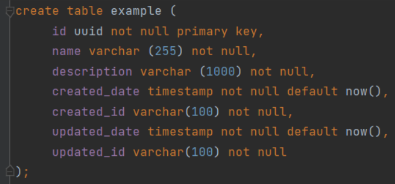
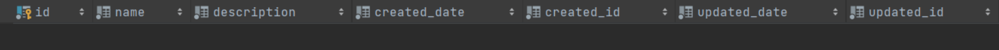
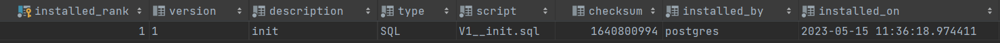

## **Flyway(10)**

### 소개

데이터베이스 스키마 마이그레이션을 위한 오픈 소스 도구이다.

소프트웨어 개발 과정에서 데이터베이스 스키마 변경은 필연적이다. Flyway는 이러한 변경 사항을 체계적으로 관리하고, 다양한 환경(개발, 테스트, 운영 등)에서의 일관성을 유지할 수 있도록 도와준다.

### 주요 기능

- **버전 관리**: 데이터베이스 스키마의 버전을 관리하여, 언제든지 특정 버전으로 롤백하거나 업데이트할 수 있다.
- **마이그레이션**: SQL 스크립트를 통해 데이터베이스 스키마 변경 사항을 적용합니다. 이 스크립트들은 버전 번호로 관리되며 순차적으로 실행된다.
- **상태 검사**: **`flyway info`** 명령어를 통해 현재 데이터베이스의 상태와 마이그레이션 히스토리를 확인할 수 있다.
- **유효성 검사**: 마이그레이션 스크립트들이 현재 데이터베이스 스키마와 일치하는지 검증한다.

### 장점

- **간편성**: 명령어 한 줄로 데이터베이스 마이그레이션을 수행할 수 있다.
- **플랫폼 독립성**: Java 기반으로 개발되어 다양한 플랫폼에서 사용할 수 있다.
- **다양한 DB 지원**: MySQL, PostgreSQL, Oracle 등 다수의 데이터베이스를 지원한다.

### 사용 방법

- 설치 및 설정: Flyway를 설치하고, **`flyway.conf`** 파일을 통해 데이터베이스 연결 정보를 설정한다.
- 마**이그레이션 스크립트 작성**: 버전 번호를 포함하는 SQL 파일을 작성한다. 작성 시엔 명명규칙을 따른다.
  예: **`V1__Initial_schema.sql`**
- **마이그레이션 실행**: **`flyway migrate`** 명령어를 실행하여 데이터베이스 스키마를 업데이트한다.

### 적용 예시

- 데이터베이스에 최초 적용 시에는 파일명을 V1__ 작성한다. 다음은 V1__init.sql로 작성한 예시이다.
    - V1_init.sql

      

- 애플리케이션을 구동하면 데이터베이스에 example 테이블과 flyway_schema_history 테이블이 생성됨을 확인할 수 있다.
    - example 테이블

      

    - flyway_schema_history 테이블

      

- 다음 예시로 example 테이블에 address 컬럼을 추가할 때는 V2__add column+example+address.sql 파일에 컬럼 추가 SQL문을 생성한다.
- 애플리케이션을 다시 구동하면 V2__add column+example+address.sql이 적용되어 example.address 컬럼 추가와 flyway_schema_history 이력이 추가됨을 확인할 수 있다.
    - example 테이블

      

    - flyway_schema_history 테이블

      

### Flyway 실습(10)
