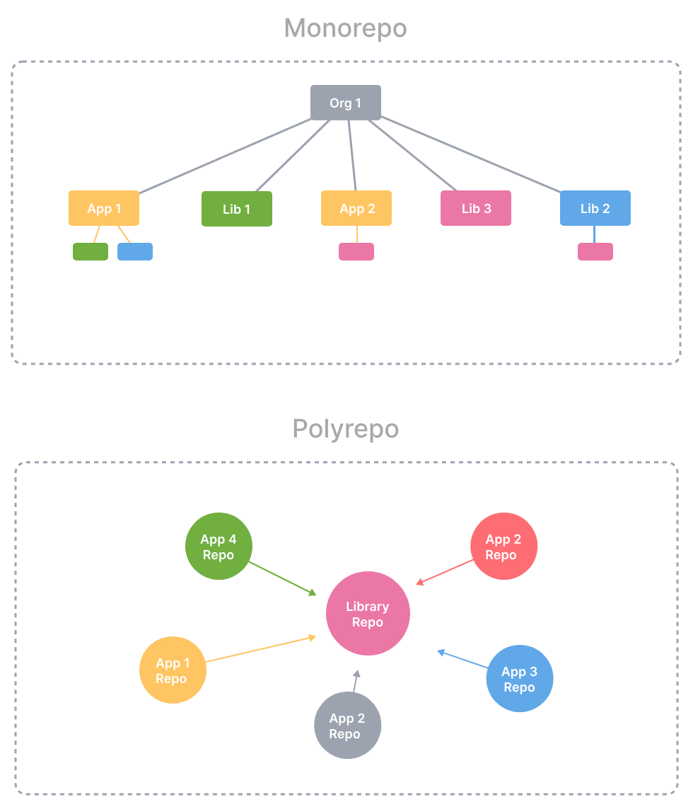
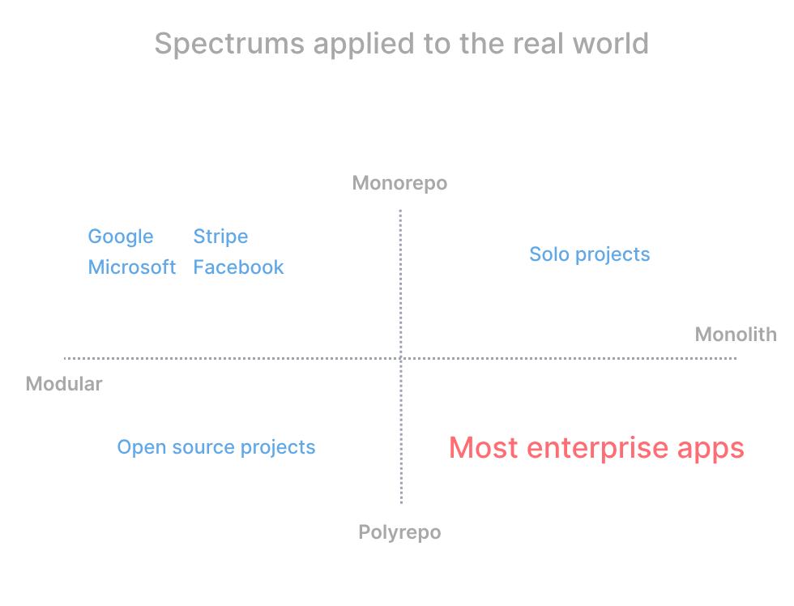
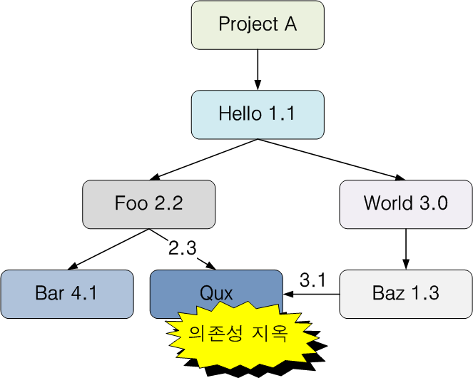

## **Mono Repo(30)**

모노레포: 잘 정의된 관계를 가진 여러 개의 별개의 프로젝트를 포함하는 단일 저장소

단순한 거대 저장소가 아니며, 모놀리식과는 정 반대의 저장소이다. (Monorepo ≠ Monolith)

단일 저장소 여러 프로젝트의 코드가 동일한 저장소에 저장되는 소프트웨어 개발 전략이라고 할 수 있다. 구글, 메타, 마이크로소프트, 우버, 에어비앤비, 트위터 모두 대량의 코드를 단일 저장소로 관리하고 이에 대한 빌드 및 배포를 위하여 다양한 전략을 취하고 있다.

### 장점

### **코드 재사용의 용이성**

하나의 대규모 저장소에서 모든 코드를 관리하기 때문에 다른 프로젝트에서 공통으로 사용되는 코드나 라이브러리를 쉽게 공유하고 재사용할 수 있다. 이는 개발자들이 비슷한 기능을 반복해서 작성하는 것을 피하고 개발 생산성을 높일 수 있다.

### **간소화된 종속성 관리**

동일한 서드 파티 종속성에 의존하더라도 여러 프로젝트가 있다면 해당 종속성을 여러 번 다운로드하거나 빌드해야 할 수 있다. 하지만 단일 저장소에서는 참조된 종속성이 모두 동일한 코드베이스에 있기 때문에 빌드 최적화를 보다 더 쉽게 할 수 있다.

### **원자성 커밋**

함께 작동해야 하는 코드가 별도의 저장소에 위치한다면, 한 코드의 변경이 관련된 다른 저장소의 코드와 잘 동작하는지 확인하기 위해 버전별로 확인하고 지속적으로 동기화를 해야 한다. 프로젝트가 일정 크기를 넘어선다면 프로젝트 사이의 버전을 관리하는 것이 문제가 될 수 있으며, 이런 경우를 흔히 종속성 지옥이라고 칭한다. 단일 저장소에서는 여러 프로젝트에 걸쳐 원자적으로 변경할 수 있기 때문에 이러한 문제가 무효화된다. 이는 서드 파티 종속성의 버전이 변경되는 경우에도 마찬가지이며, 관련된 모든 프로젝트가 하나의 저장소에 있기 때문에 그 이력을 효과적으로 추적하고 관리할 수 있다.

### 대규모 코드 리팩토링

개발자는 전체 프로젝트에 접근할 수 있기 때문에 여러 프로젝트에 걸쳐서 리팩토링을 할 수 있으며, 리팩토링 이후에도 프로젝트의 모든 부분이 잘 작동함을 쉽게 확인할 수 있다.

### 팀 간 협업

다른 팀들이 진행 중인 프로젝트를 개선하는 데에 참여할 수 있으며, 유관 프로젝트에 대한 이해도를 높일 수 있다.

### 단점

### **버전 정보 손실**

모든 프로젝트에서 하나의 버전 번호를 사용하기 때문에 유의적 버전(semantic versioning)을 사용하기 어려워진다.

### **프로젝트별 접근 제어가 어려움**

저장소별 접근 권한을 설정할 수 없기 때문에 새로운 보안 문제가 있을 수도 있다. 하지만, 경로 기반으로 제어가 가능한 서비스를 사용하는 경우에는 액세스를 제한할 수 있다. (예: subversion의 경로 기반 권한 제어, GitHub의 codeowner 등)

### **기본적으로 더 많은 저장 공간 필요**

기본적으로 관심 있는 프로젝트만 가져오지 않기 때문에 상당한 양의 저장 공간을 차지할 수 있다. 모든 버전 관리 시스템에는 부분 체크아웃을 위한 메커니즘이 있지만, 그렇게 하면 단일 저장소의 장점 중 일부가 무효화된다.

### **확장성 문제**

일반적인 경우는 아니지만, 구글의 경우 수십억줄의 코드를 단일 저장소에서 관리하고 있다. 이런 경우 기존의 버전 관리 소프트웨어가 효율적으로 동작하지 않을 수 있다.

### 비교

| Mono repo가 유리한 점 | Poly repo가 유리한 점 |
| --- | --- |
| 코드 재사용이 쉬움 | 프로젝트별 높은 독립성을 가짐 |
| 버전 관리가 용이 | 단일 프로젝트의 빌드 및 배포가 단순 |
| 여러 프로젝트에 걸친 리팩토링이 가능 | 더 섬세한 접근 제어 |
| 여러 프로젝트에 걸친 변경 추적성 강화 | 단일 프로젝트 기준으로 더 높은 공간 효율성 |

### 관련 도구

Gradle, Rush, moon 등등 (https://monorepo.tools/#tools-review)

### **Gradle과 단일 저장소**

Gradle은 자바를 비롯한 JVM 언어로 작성된 프로젝트의 빌드, 테스트, 배포를 자동화하기 위한 오픈 소스 빌드 자동화 도구이다. Apache Ant와 Apache Maven의 장점을 결합한 것으로 평가받으며, 더 강력하고 유연하게 빌드 스크립트를 작성하고 관리할 수 있다. Gradle은 2023년 현재 안드로이드 앱 개발 및 다양한 서버 및 클라이언트를 빌드하는 데 널리 사용되고 있다. 대표적으로 스프링 부트(Spring Boot) 또한 Gradle로 빌드 및 관리되고 있다.

Gradle은 여러 프로젝트에 대한 관리를 적극적으로 지원한다. 이런 경우 하나의 거대 프로젝트 안에 하위 프로젝트를 두는 형태로 프로젝트를 구성하게 된다. Gradle은 한 번에 여러 하위 프로젝트를 빌드하거나 하나의 하위 프로젝트만 빌드하는 기능을 지원하며, 하위 프로젝트 사이의 의존 관계를 그래프로 관리하고 이를 최적화하여 효율적으로 빌드할 수 있게 한다. 이렇듯 Gradle을 단일 저장소를 위한 많은 기능을 제공하고 있다.
