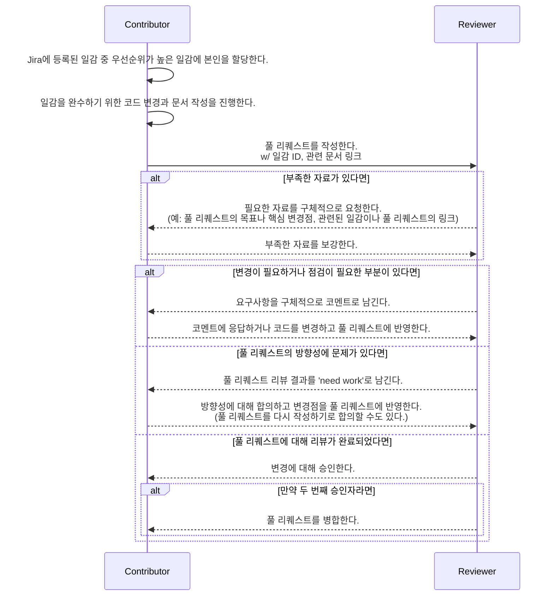

## **Pull Request Guide(30)**

### 고려 사항

---

1. 버스 팩터

Ref. https://en.wikipedia.org/wiki/Bus_factor

버스 팩터(bus factor)는 팀 구성원 간에 공유되지 않는 정보 및 기능으로 인해 발생하는 위험을 측정할 때 쓰는 지표로, 특정 업무나 프로젝트가 정지할 수 있게 하는 최소 인원의 수를 말한다. 버스 팩터는 버스 문제(bus problem), 트럭 팩터(truck factor), 버스/트럭 넘버(bus/truck number)라고도 불리며, 이는 경영에서 말하는 핵심 인재 위험(key person risk)과 유사하다고 볼 수 있다. 프로젝트 관점에서는 버스 팩터가 1인 업무는 단일 실패 지점(SPoF)로 볼 수 있기 때문에 이를 높이기 위한 프로젝트 차원의 접근이 필요하다.

1. 코드 리뷰

Ref. https://en.wikipedia.org/wiki/Code_review

코드 리뷰(code review)는 적어도 한 명 이상의 코드 작성자가 아닌 사람이 코드를 검토하는 행동이다. 품질 문제를 발견하는 것이 코드 리뷰의 주요 목표인 경우가 많지만, 일반적으로 코드 리뷰를 통해 이루고자 하는 것들은 다음과 같다.

- 더 나은 코드 품질
- 결함 찾기
- 학습/지식 전파
- 상호 책임 의식 향상
- 더 나은 솔루션 찾기
- 지침 및 표준 준수
1. 풀 리퀘스트

Ref. https://en.wikipedia.org/wiki/Distributed_version_control#Pull_requests

풀 리퀘스트(pull request)는 분산 버전 제어 시스템에서 활용되는 일반적인 기여(contribution) 방법이다. 기여자는 프로젝트 관리자가 소스 코드 변경을 풀 하도록 요청하기 때문에 풀 리퀘스트(pull request)라고 불린다.

Git 저장소 호스팅 서비스별로 상세한 구현과 제약은 다르지만 기본적으로 스레드 기반으로 대화를 할 수 있으며, 변경될 코드에 대한 집중적인 논의가 가능한 점은 GitHub, GitLab, Bitbucket 모두 동일하게 지원하고 있다.

AM 프로젝트의 소스 코드 형상 관리에 사용되는 Bitbucket Data Center 또한 풀 리퀘스트를 지원하고 있으며, 엔터프라이즈 버전의 기능으로 풀 리퀘스트를 통하지 않은 변경을 거절하거나 풀 리퀘스트를 병합하기 위해 필요한 최소 승인자의 수를 명시적으로 제약할 수 있다.

### 협업 가이드

---

1. 원칙
- Pull Request
    - 제목은 아래와 같은 접두어로 시작해야 한다.
        - Jira 이슈에서 비롯된 변경은 Jira 이슈의 ID
        - 관련된 Jira 이슈가 없는 경우 ‘NO-ISSUE’
    - 제목은 영어로 작성한다.
    - 본문은 한글 또는 영어로 작성할 수 있다.
    - 모든 변경은 풀 리퀘스트를 통해 반영해야 한다.
        - 승인자가 2명 이상이어야 한다.
- Code Review
    - 변경에 대해 작성자와 같이 책임질 수 있을 때 풀 리퀘스트를 승인한다.
    - 변경에 대해 리뷰 가능한 유관 업무자는 Bitbucket Reviewer Group으로 등록하고 관리한다.
- Branch
    - 지정해야 하는 Bitbucket Reviewer Group에 따른 접두어로 시작하는 이름을 가져야 한다.
- Commit
    - 제목은 영어로 작성한다.
    - 본문은 한글 또는 영어로 작성할 수 있다.
1. 프로세스



1. Commit Message Convention

```markdown
[관련 이슈] 영어로 작성된 제목

제목과 빈줄로 구분된 본문
```

- 관련 이슈
    - 관련된 Jira 이슈가 있다면, 앞에 이슈 번호를 입력해 준다.
      예: PRJSDSAM-100
    - 관련 이슈가 없다면, 앞에 ‘NO-ISSUE'라고 기입한다.
- 영어로 작성된 제목
    - 제목이기 때문에 첫 글자는 대문자로 시작한다.
    - 앞에 'This commit will'이 생략되었다고 가정하고 작성한다.
        - 제목은 동사로 시작하는 명령형으로 작성한다.
        - 이때 동사는 동사 원형으로 작성한다.
    - 제목의 마지막 문장 부호(마침표, 느낌표 등)는 생략한다.
- 좋은 예시
    - NO-ISSUE Make GlobalUser know EmployeeId
    - NO-ISSUE Fix Typos: EmployeeService
    - PRJSDSAM-01 Write skeletons for Session
    - NO-ISSUE Organize imports
- 나쁜 예시
    - NO-ISSUE Bump up Gradle version into 8.1!!
        - 제목이 문장 부호로 끝났음
    - typos Were Fixed
        - 동사로 문장이 시작하지 않았음
        - 관련 Jira 이슈가 있는지 없는지 알 수 없음
        - 첫 번째 글자가 대문자가 아님
1. Branch Convention
- 기본 브랜치 이름은 main으로 한다.
- main 브랜치는 풀 리퀘스트로만 변경을 반영할 수 있다.
- 이외의 브랜치는 자유롭게 생성 가능하다.
    - 단, 생성된 지 2주가 지난 브랜치는 강제로 제거될 수 있다.
    - 기본 리뷰어 지정이 필요한 경우 위의 Bitbucket Default Reviewer Group의 브랜치 접두어를 참고하여 브랜치를 명명한다.
1. Pull Request Convention

5.1 Title

- Commit 제목과 동일한 규약을 따른다.

5.2 Description

```markdown
# Goals
 
* PR의 목표를 기술한다.
  * 예시: Session의 도메인 모델링을 코드로 작성한다.
* 부가 목표가 있다면 기술한다.
  * 예시: 스켈레톤 코드를 작성하여 추후 작업의 병렬성을 마련한다.
 
# Descriptions
 
* 변경에 대한 설명이 필요한 경우 작성한다. (Optional)
 
# Referneces
 
* 의존 관계가 있는 경우 기술한다.
  * Ref. https://support.atlassian.com/bitbucket-cloud/docs/markup-comments/)
  * 예시: Required by #30
  * 예시: Requires #28, #29
* 관련 문서가 있는 경우 기술한다.
  * 예시: 전체 작업 초안(https://....)
```

- 필수로 작성해야 하는 부분
    - Goals
- 경우에 따라 없을 수도 있는 부분
    - Descriptions
    - References
1. Review Result Convention
- Approve: 변경에 동의하며, 변경에 따른 책임을 함께 하겠음
- Comment: 방향성에 대한 피드백은 없으나 추가 변경이 있으면 좋겠
- Need Work: 방향성에 대해 반대하며, 이대로 진행되면 안 됨을 나타냄

### PR 실습
