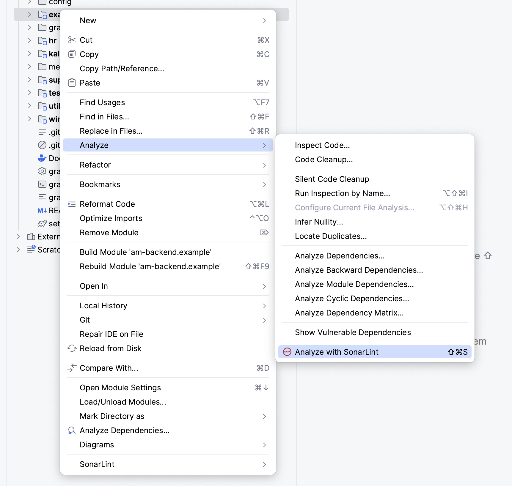
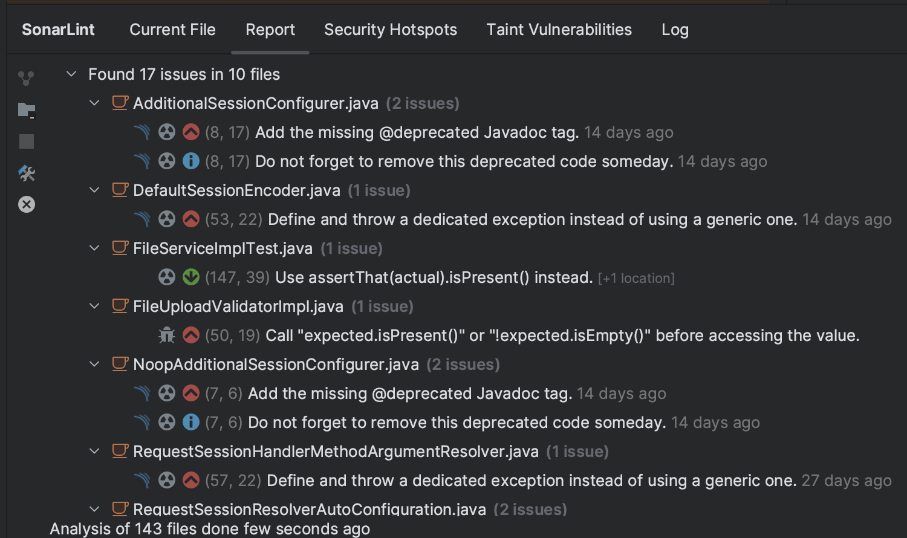

## Security

### Image Scan(10)


Targets (what Trivy can scan):
* Container Image
* Filesystem
* Git Repository (remote)
* Virtual Machine Image
* Kubernetes
* AWS

Scanners (what Trivy can find there):
* OS packages and software dependencies in use (SBOM)
* Known vulnerabilities (CVEs)
* IaC issues and misconfigurations
* Sensitive information and secrets
* Software licenses

## trivy 실습
### Installation

```
curl -sfL https://raw.githubusercontent.com/aquasecurity/trivy/main/contrib/install.sh | sh -s -- -b /usr/local/bin v0.49.1
```

특정 이미지(python:3.4-alpine)의 취약점 중 CRITICAL,HIGH 2가지만 조회하는 경우
```
trivy image -s CRITICAL,HIGH python:3.4-alpine
```

### **Static code analysis**

**정의**

정적 분석 또는 소스 코드 분석이라고도 하는 정적 코드 분석은 프로그램을 실제로 실행하지 않고 소프트웨어 애플리케이션의 소스 코드를 분석하는 방법이다. 정적 코드 분석은 일련의 코딩 규칙 또는 표준에 따라 코드를 검사하는 자동화된 도구에 의해 수행된다.

**목표**

정적 코드 분석의 목표는 소스 코드에서 잠재적인 취약성, 보안 결함 및 기타 유형의 코딩 문제를 식별하는 것이다. 이를 통해 개발자는 코드가 규정을 준수하고 안전하며 보안이 유지되는지 확인할 수 있다.

정적 코드 분석은 일반적으로 소프트웨어 테스트가 시작되기 전 개발 프로세스 초기에 수행되며, 개발자가 코드 문제를 조기에 식별하고 수정할 수 있는 자동화된 피드백 루프를 생성하여 DevOps 관행을 지원한다.

정적 코드 분석은 코드 구조에 대한 이해를 제공하고 업계 표준 및 코딩 가이드라인을 준수하는 데 도움이 되는 화이트박스 테스트의 한 형태이다. 일반적으로 버퍼 오버플로, 잠재적 취약성 및 보안 결함과 같은 코딩 문제를 감지하는 데 사용된다.

정적 코드 분석은 소스 코드를 스캔하고 정의된 코딩 규칙과 비교하여 검사하는 자동화된 도구를 실행하여 수행된다.

분석 프로세스는 개발 초기 단계의 소프트웨어 테스트 전에 수행되며, 종종 DevOps 워크플로에 통합된다.

정적 코드 분석 도구는 소프트웨어 개발 수명 주기 후반에 애플리케이션에 부정적인 영향을 미칠 수 있는 품질 또는 보안 문제를 식별할 수 있다.

정적 코드 분석 도구를 사용하면 소프트웨어 결함을 줄이고 복잡한 코드베이스와 관련된 위험을 낮추며 코드 품질과 애플리케이션 보안을 지속적으로 개선할 수 있다.

프로젝트 또는 업계의 코딩 표준과 요구 사항을 지원하는 정적 코드 분석 도구를 선택하는 것이 중요하다.

요약하면, 정적 코드 분석은 코드 품질을 보장하고 코딩 문제를 감지하며 애플리케이션 보안을 개선하는 데 유용한 기술이다. 개발자는 자동화된 도구를 사용하여 소스 코드를 분석함으로써 개발 프로세스 초기에 잠재적인 취약성 및 보안 결함을 식별하고 수정하여 최종 소프트웨어 제품에 결함이 발생할 위험을 줄일 수 있다.

**분석도구**

SonarQube 는 코드 품질을 지속적으로 검사하기 위해 SonarSource에서 개발한 오픈소스 플랫폼이다. 코드의 정적 분석을 통해 자동 검토를 수행하여 여러 프로그래밍 언어에서 버그와 좋지 않은 코드를 감지한다.

**적용 룰셋**

SonarLint는 IDE에서 사용하는 코드 품질 및 보안 문제 식별 도구로, 기본적인 룰셋을 포함하고 있다.

- 코드 품질 규칙: 코드 스멜, 버그, 코드스타일
- 보안 규칙: 보안 취약점(Vulnerabilities), 보안 핫스팟(Security Hotspots)

**SonarLint 적용 방법**

대부분의 IDE에서 플러그인 형식으로 지원하고 있다.






**CI와의 통합**

- **CI 파이프라인에 SonarLint 통합**: 자동화된 빌드 및 테스트 파이프라인에 SonarLint를 통합하여 코드 품질 검사를 자동화할 수 있다. 이를 통해 코드 리뷰 과정에서 발견되지 않은 이슈를 조기에 발견하고 해결할 수 있다.
- **SonarQube/SonarCloud와 연동**: 대규모 프로젝트의 경우, SonarLint와 함께 SonarQube 또는 SonarCloud를 사용하여 더 광범위한 코드 품질 관리를 수행한다. CI 파이프라인을 통해 코드 변경 사항을 정기적으로 SonarQube/SonarCloud에 업로드하고, 상세한 코드 품질 보고서를 받을 수 있다.

**참조 프로세스**


