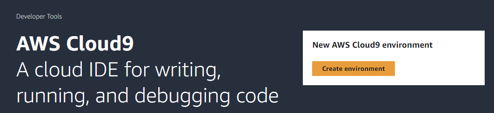
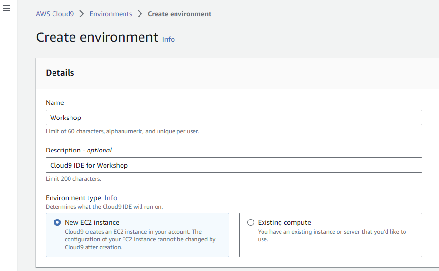
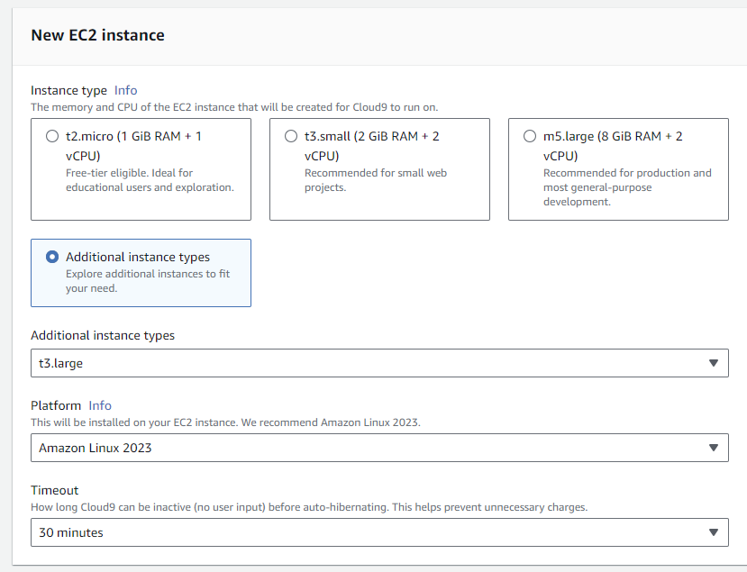
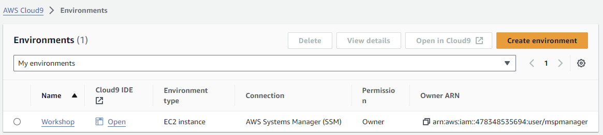
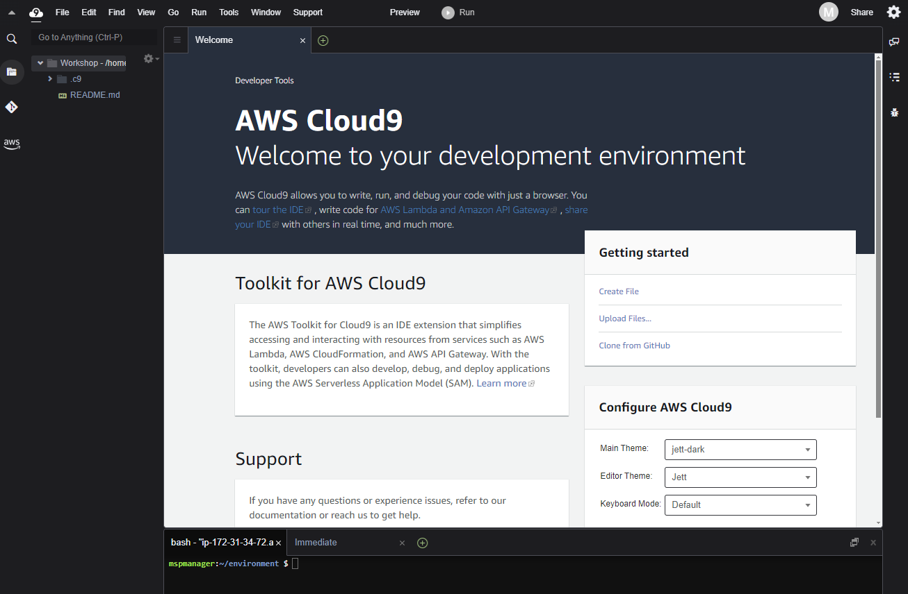
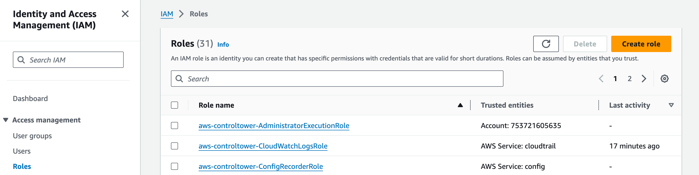
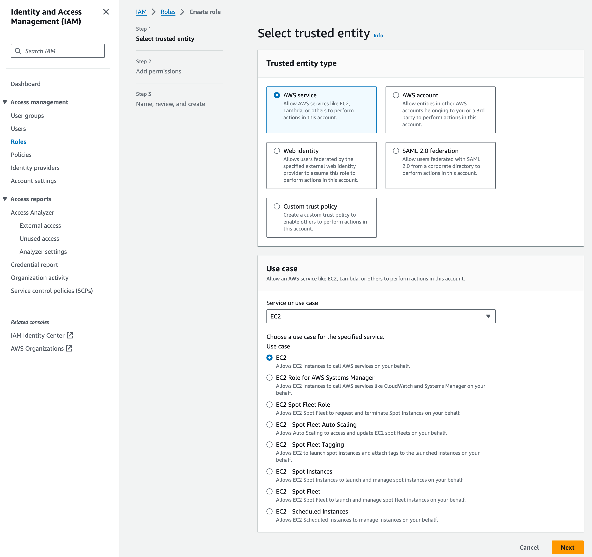
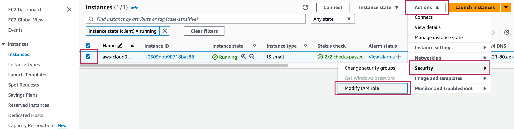
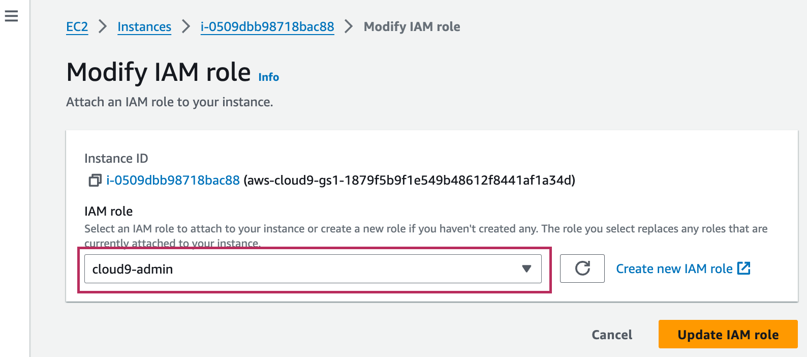
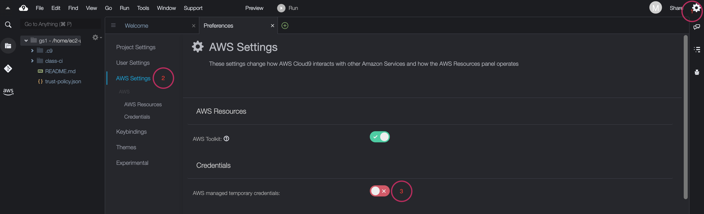

## Cloud9 IDE 환경 구성


### Cloud9 IDE 생성
AWS 서비스에서 Cloud9을 선택하고, "Create Environments" 버튼을 클릭합니다.  


Cloud9 이름과 Descriiption을 설정합니다. 



### Cloud9 구성
Instance type을 변경합니다. 

Instance type - Additional instance types - t3.large  


> [!NOTE]
> Cloud9 하단의 설정 메뉴 중에 Network Setting은 변경하지 않으면, 자동으로 VPC Default로 설정되며 Cloud9 인스턴스는 해당 Default VPC의 public subnet에 자동으로 설치됩니다.

AWS Console에서 Cloud9 생성한 것을 확인합니다.


"Open"을 눌러 Cloud9 IDE를 오픈합니다.


### Cloud9 IAM Role 생성 및 변경
Administrator access 정책을 가진 IAM Role을 생성하여 AWS Cloud9에 할당.
> [!NOTE]
> 본 실습의 경우, AdministratorAccess 정책을 사용하지만 실제 프로덕션 환경을 구동할 때에는 최소 권한을 부여하는 것이 적합합니다.

#### Role 생성
1. AdministratorAccess 권한을 가진 role 생성
Search - IAM - 좌측 Access management 영역 Roles 선택 - Create role 클릭


2. Step 1 Select trusted entity:  Trusted entity type - AWS service, Use case - EC2 선택

3. Permissions policies 에서 `AdministratorAccess` 체크 후 Next
4. Role name `cloud9-admin` 입력 후 Create role 버튼 클릭

#### Cloud9에 Role 부여

1. [EC2 Instance page](https://console.aws.amazon.com/ec2/v2/home?#Instances:sort=desc:launchTime)를 클릭하여 EC2 인스턴스 페이지에 접속
2. 해당 인스턴스를 선택 후, Actions > Security > Modify IAM Role을 클릭
   
3. IAM Role에서 `cloud9-admin` 선택 후 Update IAM role 클릭
   

### Cloud9에서 IAM 설정 업데이트
AWS Cloud9의 경우, IAM credentials을 동적으로 관리 따라서 이 credentials을 비활성화 하고 조금 전 생성한 IAM role을 부여  

1. AWS Cloud9 IDE 접속 - 우측 상단 기어 아이콘 클릭 
2. Credentials 에서 AWS managed temporary credentials 비활성화
   
3. Temporary credentials이 없는지 확실히 하기 위해 기존의 자격 증명 파일도 제거
```bash
rm -vf ${HOME}/.aws/credentials 
```
4. `GetCallerIdentity CLI` 명령어를 통해, Cloud9 IDE가 올바른 IAM Role을 사용하고 있는지 확인
```bash
aws sts get-caller-identity --query Arn | grep cloud9-admin
```

### Cloud9 환경 변수 설정
환경변수: ACCOUNT_ID, AWS_REGION 정보 설정
```bash
# ACCOUNT_ID
export ACCOUNT_ID=$(aws sts get-caller-identity --output text --query Account)
echo "export ACCOUNT_ID=$(aws sts get-caller-identity --output text --query Account)" >> ~/.bashrc

# AWS_REGION
export AWS_REGION=ap-northeast-2
echo "export AWS_REGION=ap-northeast-2" >> ~/.bashrc
```

### Cloud9 에 패키지 설치
#### **Kubectl 설치**
EKS를 위한 kubectl 바이너리를 다운로드합니다. Kubernetes 버전 1.23 출시부터 공식적으로 Amazon EKS AMI에는 containerd가 유일한 런타임으로 포함됩니다.
> [!NOTE]
> Amazon EKS 클러스터 제어 영역과 마이너 버전이 하나 다른 kubectl 버전을 사용해야 합니다. 예를 들어 1.28 kubectl 클라이언트는 Kubernetes 1.27, 1.28, 1.29 클러스터와 함께 작동합니다.

```bash
# kubectl download
curl -O https://s3.us-west-2.amazonaws.com/amazon-eks/1.28.5/2024-01-04/bin/linux/amd64/kubectl


# 바이너리에 실행 권한을 적용
chmod +x ./kubectl

# 바이너리를 PATH의 폴더에 복사 및 설정
mkdir -p $HOME/bin && cp ./kubectl $HOME/bin/kubectl && export PATH=$HOME/bin:$PATH
echo 'export PATH=$HOME/bin:$PATH' >> ~/.bashrc

# 자동완성
source <(kubectl completion bash) 
echo "source <(kubectl completion bash)" >> ~/.bashrc

alias k=kubectl
complete -o default -F __start_kubectl k

echo "alias k=kubectl" >> ~/.bashrc
echo "complete -o default -F __start_kubectl k" >> ~/.bashrc

source ~/.bashrc

# kubectl 버전 확인
kubectl version --client
```

#### **Homebrew 설치**
Homebrew는 Apple(또는 Linux 시스템)에서 제공하지 않는 유용한 패키지 관리자를 설치합니다.  

> [!NOTE]
> homebrew설치할때 패스워드 묻기 때문에 미리 설정합니다.

ec2-user 패스워드 설정
```
sudo passwd ec2-user
```

homebrew 설치
```bash
/bin/bash -c "$(curl -fsSL https://raw.githubusercontent.com/Homebrew/install/HEAD/install.sh)"
```

brew 관련 설정을 profile에 추가합니다.
```bash

(echo; echo 'eval "$(/home/linuxbrew/.linuxbrew/bin/brew shellenv)"') >> /home/ec2-user/.bash_profile

eval "$(/home/linuxbrew/.linuxbrew/bin/brew shellenv)"
```

설치 확인
```
brew -v
```

#### **Helm 설치**
Helm은 쿠버네티스를 위한 패키지 관리 도구입니다.  

설치 
```
brew install helm
```

설치 확인
```
helm version
```
