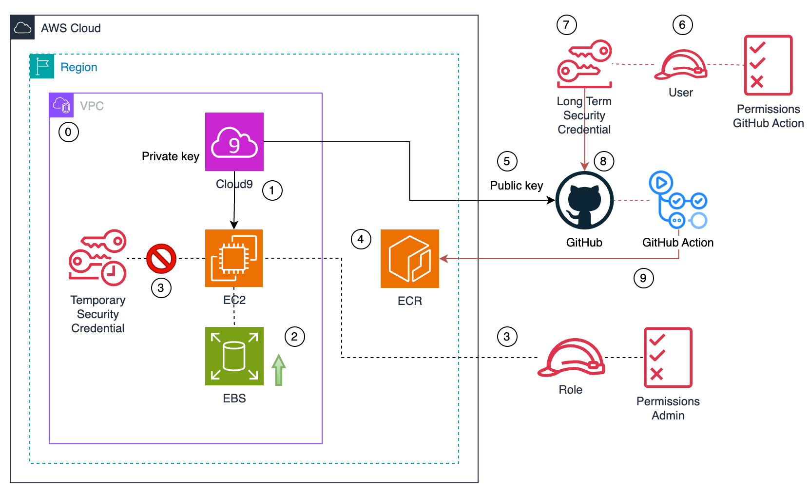
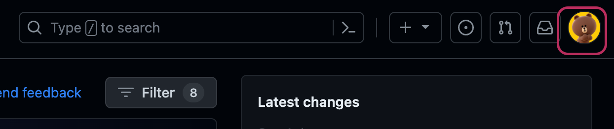
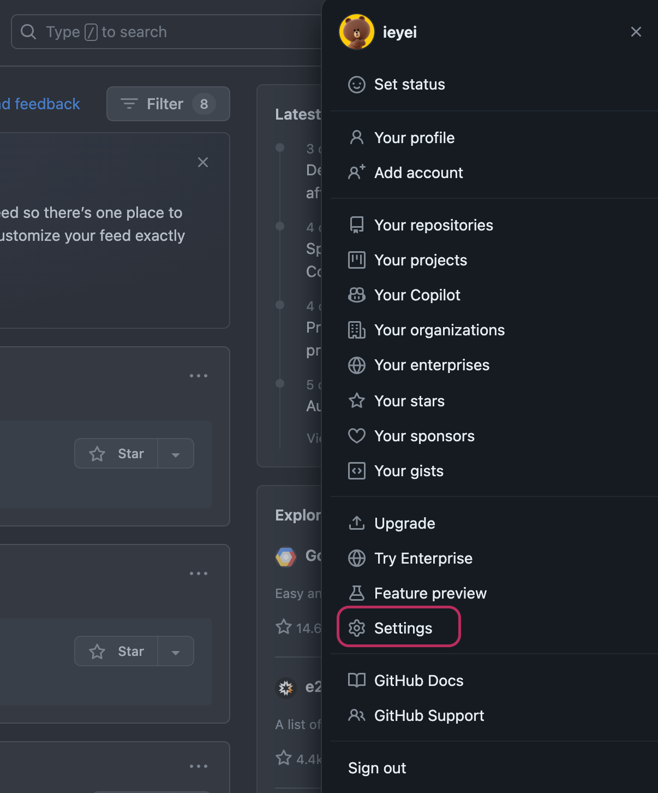
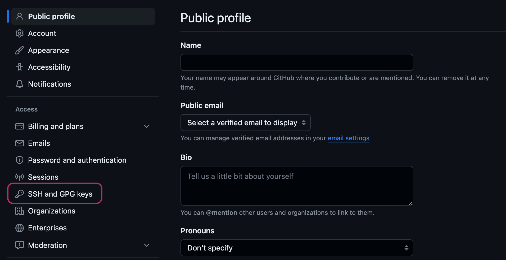
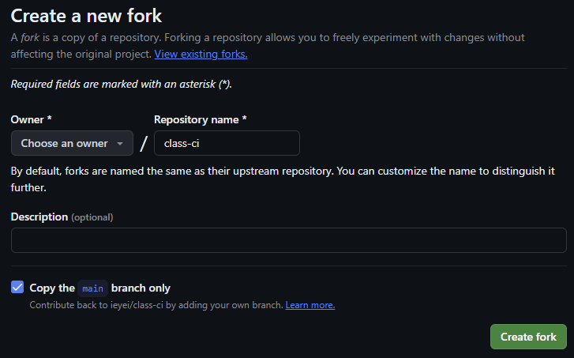
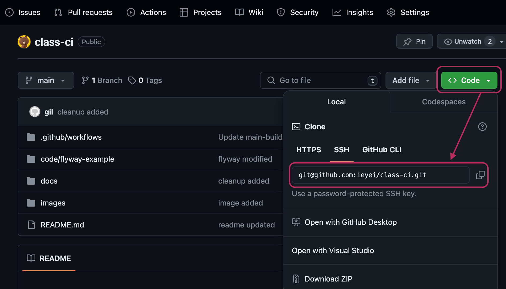

# Configuration

## ECR Repository 생성

4번 실습

`Lab Location`: :cloud:

AWS CLI를 통해, 이미지 리포지토리를 생성.  
repository name: ci-sample  
```
export ECR_REPOSITORY="ci-sample"
export AWS_REGION="ap-northeast-2"

aws ecr create-repository \
--repository-name ${ECR_REPOSITORY} \
--image-scanning-configuration scanOnPush=true \
--region ${AWS_REGION}
```

확인
```bash
aws ecr describe-repositories
```

:coffee:    **Record - Create ECR**


## GitHub 설정
### Git 인증

5번 실습

`Lab Location`: :cloud:

username, email 내용을 본인에 맞게 변경
```bash
export USERNAME="MY USERNAME"
export EMAIL="MY EMAIL"
```


> [!NOTE]
> github MFA 인증을 사용 하고 있는 경우, personal access token을 만들어 password로 사용.
> personal access token 만드는 방법: [Managing your personal access tokens](https://docs.github.com/en/authentication/keeping-your-account-and-data-secure/managing-your-personal-access-tokens#creating-a-fine-grained-personal-access-token)
---

#### ssh 연결
**ssh key 생성**
참고 URL: [Generating a new SSH key](https://docs.github.com/en/authentication/connecting-to-github-with-ssh/generating-a-new-ssh-key-and-adding-it-to-the-ssh-agent?platform=mac#generating-a-new-ssh-key)  
email 주소는 github 가입 시 사용한 주소로 변경
> [!NOTE]
> ssh-keygen 실행 시 물어보는 모든 것들은 입력 값 없이 `enter`
```bash
ssh-keygen -t rsa -b 4096 -C ${EMAIL}
```

```
Generating public/private rsa key pair.
Enter file in which to save the key (/home/ec2-user/.ssh/id_rsa): 
Enter passphrase (empty for no passphrase): 
Enter same passphrase again: 
Your identification has been saved in /home/ec2-user/.ssh/id_rsa
Your public key has been saved in /home/ec2-user/.ssh/id_rsa.pub
The key fingerprint is:
SHA256:vHTZ6QOy+0iNVIFGq12RYtIEZZ0Z3vQCipP/xURq4SI your_email@example.com
The key's randomart image is:
+---[RSA 4096]----+
|      .*=o*=o    |
|      .+*==X .   |
|      E++.B + .  |
|       B = = o   |
|      . S + =    |
|       o O +     |
|        = o o    |
|       . o   .   |
|        o..      |
+----[SHA256]-----+
```

public key 복사
```
cat ~/.ssh/id_rsa.pub
```

`Lab Location`: :octocat:

1. github 페이지 우측 상단 profile 클릭
    
2. Settings 선택
    
3. Settings 상세페이지 좌측 Access > `SSH and GPG keys` 클릭
    
4. `New SSH key` 클릭 > ssh key 등록(Key 영역에 위에서 생성한 `pub key` 내용 붙여 넣기)
    

:coffee:    **Record - Auth Git**


### CI 파이프라인을 위한 AWS IAM 생성 및 policy 설정

6번 실습

`Lab Location`: :cloud:

sample app을 빌드 하고, docker image로 만든 다음 ECR에 push 하는 과정은 `gitHub Action`을 통해 이루어지며 이 때 least privilege 정책에 따른 IAM User 생성.

#### IAM User 생성
```
aws iam create-user --user-name github-action
```

#### ECR Policy 생성
ecr-policy.json 이름으로 policy 생성.

```
cd ~/environment
cat <<EOF> ecr-policy.json
{
    "Version": "2012-10-17",
    "Statement": [
        {
            "Sid": "AllowPush",
            "Effect": "Allow",
            "Action": [
                "ecr:GetDownloadUrlForLayer",
                "ecr:BatchGetImage",
                "ecr:BatchCheckLayerAvailability",
                "ecr:PutImage",
                "ecr:InitiateLayerUpload",
                "ecr:UploadLayerPart",
                "ecr:CompleteLayerUpload"
            ],
            "Resource": "arn:aws:ecr:${AWS_REGION}:${ACCOUNT_ID}:repository/$ECR_REPOSITORY"
        },
        {
            "Sid": "GetAuthorizationToken",
            "Effect": "Allow",
            "Action": [
                "ecr:GetAuthorizationToken"
            ],
            "Resource": "*"
        }
    ]
}
EOF
```

`ecr-policy` 이름으로 IAM policy 생성.
```
aws iam create-policy --policy-name ecr-policy --policy-document file://ecr-policy.json
```

#### ECR policy를 IAM user에 부여
IAM user에게 새로 생성한 ecr-policy 할당.
```
aws iam attach-user-policy --user-name github-action --policy-arn arn:aws:iam::${ACCOUNT_ID}:policy/ecr-policy
```

### AWS Credential 생성 및 설정

7,8번 실습

gitHub action에서 사용할 AWS credential 생성 및 설정.

#### AWS Credential 생성  
앞 단계에서 생성한 IAM User의 Access Key, Secret Key 생성.
```
aws iam create-access-key --user-name github-action
```
출력 결과의 `SecretAccessKey`, `AccessKeyId` 값은 따로 저장.
```
{
  "AccessKey": {
    "UserName": "github-action",
    "Status": "Active",
    "CreateDate": "xxx",
    "SecretAccessKey": "***",
    "AccessKeyId": "***"
  }
}
```
> [!NOTE]
> `SecretAccessKey`, `AccessKeyId` 값은 최초 생성 할 때만 확인 가능.

#### AWS Credential 설정

`Lab Location`: :octocat:

git fork
github: https://github.com/ieyei/class-ci




Repository 상단 `Settings` 클릭 후 좌측 메뉴 `Secrets and variables > Actions` 클릭.  
`New repository secret` 버튼을 클릭하여 앞서 저장한 IAM User `github-action`의 `SecretAccessKey`, `AccessKeyId` 값을 Secret에 저장.  


Actions 클릭 후 Actions secrets and variables 화면에서 `new repository secret` 클릭 후 `AWS_ACCESS_KEY_ID`,`AWS_SECRET_ACCESS_KEY` 각각 등록.

Name: `AWS_ACCESS_KEY_ID`  
Secret: AccessKeyId 의 값  

Name: `AWS_SECRET_ACCESS_KEY`  
Secret: SecretAccessKey 의 값

등록 후 화면


:coffee:    **Record - Secret configuration**
> [!NOTE]
> 영상에는 git fork 부분 생략되어 있으며 실습 시 각 개인이 fork 필요(위 스크린샷 참조) 


### Sample code git clone
`Lab Location`: :cloud:

실습을 위해 GitHub 본인 계정으로 fork 한 repostitory 를 `git clone` 한다.  

> [!NOTE]
> Are you sure you want to continue connecting (yes/no/[fingerprint])? --> 묻는 단계가 나올 경우 `yes`



```bash
git clone git@github.com:{username}/class-ci.git
```

실행 결과
```bash
mspmanager:~/environment $ git clone git@github.com:ieyei/class-ci.git
Cloning into 'class-ci'...
The authenticity of host 'github.com (20.200.245.247)' can't be established.
ED25519 key fingerprint is SHA256:+DiY3wvvV6TuJJhbpZisF/zLDA0zPMSvHdkr4UvCOqU.
This key is not known by any other names
Are you sure you want to continue connecting (yes/no/[fingerprint])? yes
Warning: Permanently added 'github.com' (ED25519) to the list of known hosts.
remote: Enumerating objects: 761, done.
remote: Counting objects: 100% (211/211), done.
remote: Compressing objects: 100% (119/119), done.
remote: Total 761 (delta 97), reused 193 (delta 87), pack-reused 550
Receiving objects: 100% (761/761), 287.33 MiB | 11.01 MiB/s, done.
Resolving deltas: 100% (253/253), done.
Updating files: 100% (125/125), done.
mspmanager:~/environment $ 
```

[Next - Security](./security.md)
