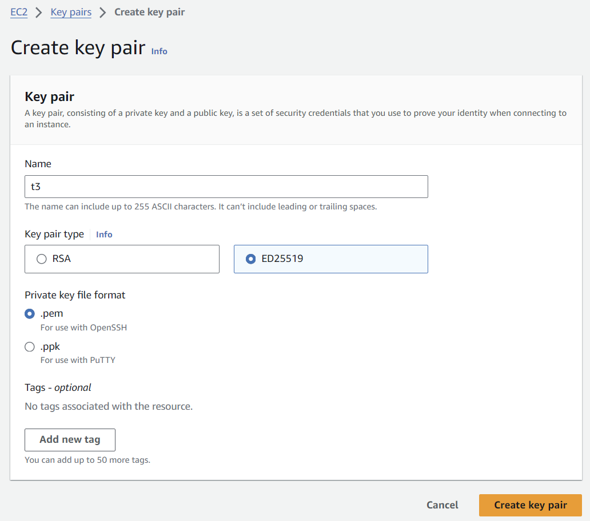
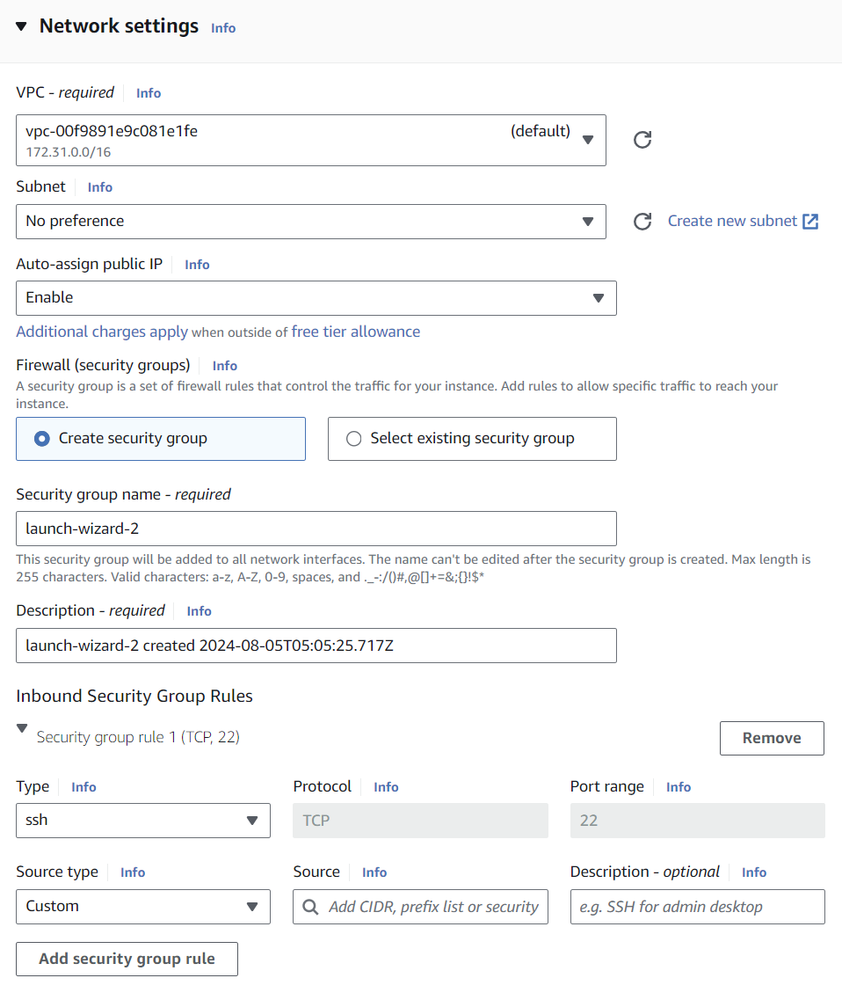
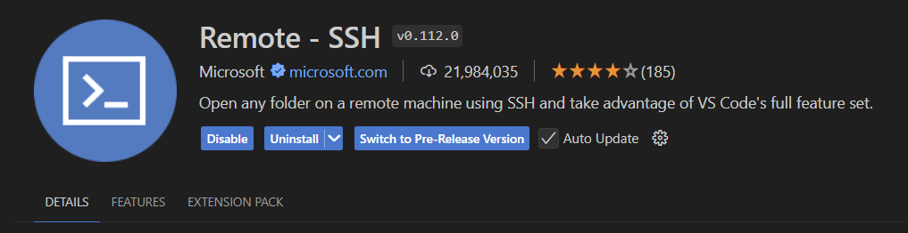
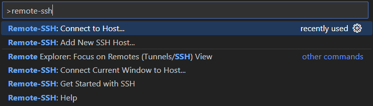
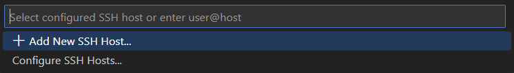

# Bastion Configuration

> [!NOTE]  
> 2024.7.25 부터 Cloud9 EOS, 따라서 Cloud9 대신 VSCODE 사용하여 Workshop 진행.  
> 포스팅 내용 일부 - _After careful consideration, we have made the decision to close new customer access to AWS Cloud9, effective July 25, 2024. AWS Cloud9 existing customers can continue to use the service as normal._  
> Link: https://aws.amazon.com/blogs/devops/how-to-migrate-from-aws-cloud9-to-aws-ide-toolkits-or-aws-cloudshell/

## EC2 구성
### Key-pair 생성
AWS Console > EC2 > Key Pairs > `Create key pair`

* Name: t3
* Key pair type: ED25519
* Private key file format: .pem



### EC2 생성
AWS Console > EC2 > Instances > `Launch instances`

* Instance type: t3.medium
* Key pair: t3
* Network settings
  * `Add security group rule`
  * source: myip  (www.myip.com)
  
* Configure storage: 30 GiB
* Launch Instance

## VSCODE 구성
### VSCODE 설치
https://code.visualstudio.com/download

### Extension 설치
Extensions(Ctrl+Shift+X) 클릭 > remote 검색 > `Remote - SSH` 설치


1. `F1` 클릭 후 **Remote-SSH: Connect to Host...** 명령어 실행. 
    
2. Configure SSH Hosts...
    
    home directory 아래 `~/.ssh/config` 선택
3. config 설정
    Host, HostName, IdentityFile 변경
   ```
   Host xxx.compute-1.amazonaws.com
    HostName xxx.compute-1.amazonaws.com
    User ec2-user
    IdentityFile "~/.ssh/t3.pem"
    ForwardAgent yes
   ```
4. AWS Console 에서 다운로드 받은 `pem` 파일을 `~/.ssh/` 아래로 복사
5. VSCODE Restart

Terminal 접속
* <code>Ctrl+\`</code>
* View > Terminal