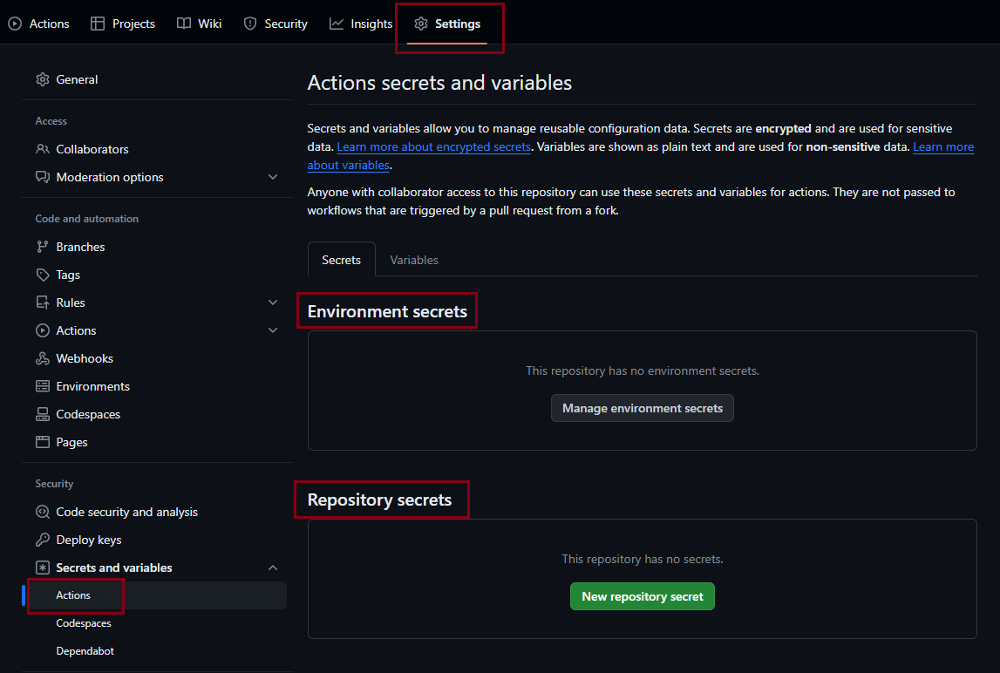
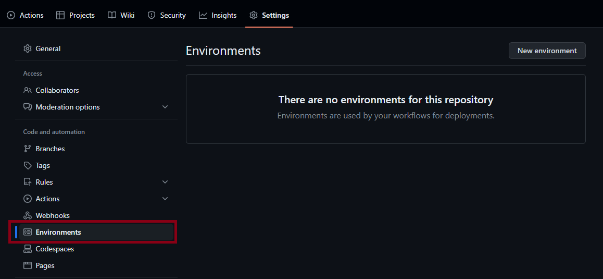

# Create CI pipeline

## GitHub Action
### GitHub Plans
#### 개인 계정용 GitHub Free
* GitHub Community Support
* Dependabot alerts
* 퍼블릭 리포지토리에 대한 배포 보호 규칙
* 2단계 인증 적용
* 500MB GitHub Packages 스토리지
* 월 120 GitHub Codespaces 코어 시간
* 월 15GB GitHub Codespaces 스토리지
* GitHub Actions 기능
  * 매월 2,000분
  * 퍼블릭 리포지토리에 대한 배포 보호 규칙

[GitHub의 Plan](https://docs.github.com/ko/get-started/learning-about-github/githubs-plans)

### Github Actions secrets and variables
우선 순위 : Environment > Repository > Organization


Environment secret 또는 variable 생성을 위해서는 `Environment` 가 필요.


등록 필요 variable
```
AWS_REGION : ap-northeast-2
CI_ENVIRONMENT : github
ECR_REPOSITORY : ci-sample
```

### github action이 사용할 build.yaml 생성


`configure` 클릭하여 Simple workflow 보기 -> go back
`set up a workflow yourself` 를 클릭하여 workflow 파일 작성

순서: checkout -> build -> push

**main-build.yaml**
```
name: Build-Main

on:
  push:
    branches: [ "main" ]
    paths:
      - 'code/flyway-example/**'

  workflow_dispatch:
    inputs:
      logLevel:
        description: 'Log level'
        required: true
        default: 'warning'
        type: choice
        options:
          - info
          - warning
          - debug
      tags:
        description: 'Test scenario tags'
        required: false
        type: boolean
      environment:
        description: 'Environment to run tests against'
        type: environment
        required: true

jobs:
  build:
    environment: ECR

    runs-on: ubuntu-latest
    steps:
      - name: Checkout source code
        uses: actions/checkout@v4

      - name: Set up JDK 17
        uses: actions/setup-java@v4
        with:
          java-version: '17'
          distribution: 'corretto'

      - name: Configure AWS credentials
        uses: aws-actions/configure-aws-credentials@v4
        with:
          aws-access-key-id: ${{ secrets.AWS_ACCESS_KEY_ID }}
          aws-secret-access-key: ${{ secrets.AWS_SECRET_ACCESS_KEY }}
          aws-region: ${{ vars.AWS_REGION }}

      - name: Login to Amazon ECR
        id: login-ecr
        uses: aws-actions/amazon-ecr-login@v2

      - name: Build, tag, and push image to Amazon ECR
        id: image-info
        env:
          ECR_REGISTRY: ${{ steps.login-ecr.outputs.registry }}
          ECR_REPOSITORY: ${{ vars.ECR_REPOSITORY }}
          IMAGE_TAG: v1
        working-directory: ./code/flyway-example
        run: |
          echo "ecr_registry=$ECR_REGISTRY" >> $GITHUB_OUTPUT
          echo "ecr_repository=${{ vars.ECR_REPOSITORY }}" >> $GITHUB_OUTPUT
          ./gradlew clean build
          cp ./build/libs/*.jar ./app.jar
          docker build --file Dockerfile --build-arg CI_ENVIRONMENT=${{ vars.CI_ENVIRONMENT }} -t main-${{github.run_number}} .
          docker image tag main-${{github.run_number}} $ECR_REGISTRY/${{ vars.ECR_REPOSITORY }}:main-${{github.run_number}}

      - name: Run Trivy vulnerability scanner
        env:
          ECR_REGISTRY: ${{ steps.login-ecr.outputs.registry }}
          ECR_REPOSITORY: ${{ steps.image-info.outputs.ecr_repository }}
          IMAGE_TAG: ${{ steps.image-info.outputs.image_tag }}
        uses: aquasecurity/trivy-action@master
        with:
          image-ref: ${{ steps.login-ecr.outputs.registry }}/${{ vars.ECR_REPOSITORY }}:main-${{github.run_number}}
          format: 'table'
          exit-code: '0'
          ignore-unfixed: true
          vuln-type: 'os,library'
          severity: 'CRITICAL,HIGH'

      - name: Push image to Amazon ECR
        id: image-push
        env:
          ECR_REGISTRY: ${{ steps.login-ecr.outputs.registry }}
          ECR_REPOSITORY: ${{ steps.image-info.outputs.ecr_repository }}
          IMAGE_TAG: ${{ steps.image-info.outputs.image_tag }}
        run: |
          docker push $ECR_REGISTRY/$ECR_REPOSITORY:main-${{github.run_number}}  

```


### GitHub Action workflow 확인
1. Code를 push하여 github action workflow 실행.
```
cd ~/environment/$GIT_REPO_NAME
git add .
git commit -m "Add github action build script"
git push origin main
```
2. Browser에서 `run workflow` 버튼 클릭하여 실행.

정상 build 확인 후 image가 ECR에 제대로 push 되었는지 확인.
